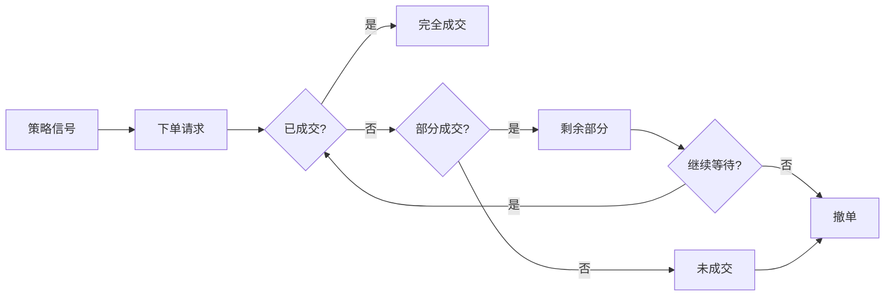

# 订单管理

> 本页定义 CTA 实盘系统中订单的各类管理操作，包括常规撤单改单、人工干预场景以及异常处理流程。

## 订单生命周期



<!-- TODO: 补充各期货交易所的订单有效期规则 -->
<!-- TODO: 添加订单状态机的详细说明 -->

## 订单状态说明

| 状态 | 含义 | 可操作 | 说明 |
|------|------|--------|------|
| 未成交 (NotTraded) | 已报入交易所未匹配 | 撤单 | 正常等待中 |
| 部分成交 (PartTraded) | 部分数量已成交 | 撤单 / 等待 | 剩余数量继续挂单 |
| 全部成交 (AllTraded) | 全部数量已成交 | 无 | 订单已完成 |
| 已撤销 (Cancelled) | 已成功撤单 | 无 | 人工或系统发起 |
| 拒单 (Rejected) | 交易所拒绝 | 无 | 需查明原因 |
| 未知 (Unknown) | 状态不明确 | 查询重试 | 网络或接口异常 |

## 常规操作

### 撤单 (Cancel Order)

| 场景 | 操作方式 | 风险提示 |
|------|----------|----------|
| 策略主动撤单 | 系统自动 | 正常流程，无需干预 |
| 超时未成交人工撤单 | vnpy 界面右键 → 撤单 | 确认订单状态后再操作 |
| 批量撤单 | API: `cancelAll()` | 避免误撤正在成交的订单 |
| 紧急撤单 (全部) | 调用 `cancelAll()` 或关闭网关 | 需确认影响范围 |

```python
# 代码级撤单示例（通过 vnpy API）
from vnpy.trader.engine import MainEngine

def cancel_order(engine: MainEngine, vt_orderid: str):
    """撤单"""
    engine.cancel_order(vt_orderid)
```

### 改单 (Modify Order)

> 注意：国内期货市场多数情况下**不支持直接改单**。通常需要先撤单，再以新价格/数量重新下单。

| 场景 | 操作流程 | 说明 |
|------|----------|------|
| 修改价格 | 撤原单 → 发新单 | 注意撤单到发单的时延 |
| 修改数量 | 撤原单 → 发新单 | 减少数量可通过部分成交 + 撤剩余实现 |
| 修改方向 | 撤原单 → 反向开单 | 注意可能形成双向持仓 |

<!-- TODO: 补充支持改单的交易所列表（如有） -->

## 人工干预场景

### 场景一：策略信号异常，需暂停下单

```bash
# 1. 暂停策略（不撤已有订单）
$ python scripts/pause_strategy.py --name StrategyName

# 2. 手动处理已有订单
# 3. 修复策略逻辑
# 4. 恢复策略运行
$ python scripts/resume_strategy.py --name StrategyName
```

### 场景二：行情剧烈波动，需要手动平仓

| 步骤 | 操作 | 风险控制 |
|------|------|----------|
| 1 | 暂停策略自动交易 | 避免策略与人工操作冲突 |
| 2 | 评估当前持仓和风险敞口 | 参见 [[../risk-management/position-limits]] |
| 3 | 手动输入平仓指令 | 分批下单，避免滑点过大 |
| 4 | 确认全部成交 | 参见 [[position-reconciliation]] |
| 5 | 解除策略暂停 | 或保持暂停直至行情稳定 |

### 场景三：系统与柜台持仓不一致

参见 [[position-reconciliation]] 章节的差异处理流程。

| 步骤 | 操作 | 说明 |
|------|------|------|
| 1 | 暂停所有策略 | 避免差异扩大 |
| 2 | 导出成交流水 | 获取完整日志 |
| 3 | 逐笔核对，确定差异订单 | 标记需处理的订单 |
| 4 | 通过柜台手动处理 | 直接联系期货公司 |
| 5 | 修正系统记录 | 同步持仓数据 |
| 6 | 恢复策略运行 | 持续监控 |

<!-- TODO: 补充多账户、多策略同时运行时的订单管理策略 -->
<!-- TODO: 添加人工干预操作的双人复核机制 -->

## 异常订单处理

| 异常类型 | 现象 | 处理步骤 | 参考 |
|----------|------|----------|------|
| 拒单 | 订单被拒，状态 = Rejected | 查看错误码 → 修正参数 → 重发 | [[../troubleshooting/order-errors]] |
| 未知状态 | 状态 = Unknown | 查询柜台 → 同步状态 | |
| 重复报单 | 同一信号发出多笔订单 | 检查策略逻辑 → 撤销重复单 | |
| 错误方向 | 本应买开但发成卖开 | 立即反向平仓 → 重新下单 | |
| 数量异常 | 仓位超出风控限制 | 检查参数 → 超额部分平仓 | [[../risk-management/controls]] |
| 连续撤单失败 | 撤单请求被拒 | 手工联系期货公司 | |
| 成交回报丢失 | 实际已成交但系统未收到 | 查询柜台成交 → 手动补充 | |

<!-- TODO: 补充常见拒单错误码及含义表 -->
<!-- TODO: 添加 CTP 限频规则：下单 / 撤单的最小间隔 -->

## 订单事务日志

所有订单操作必须记录事务日志，格式如下：

```
[2026-07-16 09:30:00] ORDER | 买入开仓 | rb2410 | 10手 | 限价3580 | 已提交 | VT_orderid_xxx
[2026-07-16 09:30:01] ORDER | 买入开仓 | rb2410 | 10手 | 限价3580 | 全部成交 | VT_orderid_xxx
[2026-07-16 14:59:00] ORDER | 人工干预 | 撤单 | rb2410 | 未成交5手 | 已撤销 | operator: 张三
```

<!-- TODO: 实现订单日志的自动采集和分析工具 -->

## 订单操作权限

| 操作 | 系统自动 | 运维人员 | 策略开发 | 说明 |
|------|----------|----------|----------|------|
| 策略信号下单 | 允许 | 禁止 | 禁止 | 仅策略自身触发 |
| 撤单 | 允许 | 允许 | 经审批 | 紧急情况可越权 |
| 手工下单 | 禁止 | 允许 | 经审批 | 必须登记理由 |
| 批量撤单 | 条件触发 | 允许 | 禁止 | 因风险控制触发 |
| 修改策略参数 | 禁止 | 允许 | 允许 | 走变更流程 |

## 相关页面

- [[position-reconciliation]] — 持仓对账（订单操作后必做）
- [[daily-checklist]] — 每日检查清单
- [[startup-shutdown]] — 启停流程
- [[../risk-management/controls]] — 风控框架
- [[../troubleshooting/order-errors]] — 订单错误排查
- [[../troubleshooting/common-issues]] — 常见故障处理
