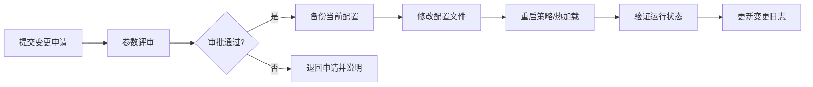

# 策略参数配置

本文档说明 vnpy CTA 策略参数配置文件的存放位置、格式规范、变更流程及变更历史记录。策略清单请参考 [[catalog]]。

## 配置文件位置

| 环境 | 配置目录 | 说明 |
|------|---------|------|
| 开发环境 | `TODO` | dev/backtest 阶段使用 |
| 模拟交易 | `TODO` | paper 阶段使用 |
| 实盘环境（主用） | `TODO` | live_small / live_full 使用 |
| 实盘环境（备用） | `TODO` | 灾备切换用 |

**TODO**：补充实际部署路径。

### 文件命名规范

```
{策略名称}_setting.json       # 主参数文件
{策略名称}_setting.json.bak    # 变更前备份
{策略名称}_setting_v{版本号}.json  # 版本归档
```

### 目录结构示例

```
TODO
├── strategies/
│   ├── strategy_a_setting.json
│   ├── strategy_b_setting.json
│   └── ...
└── archive/
    ├── strategy_a_setting_v1.0.json
    ├── strategy_a_setting_v1.1.json
    └── ...
```

**TODO**：补充实际目录结构。

---

## 配置格式

### JSON 结构模板

```json
{
  "class_name": "StrategyName",
  "vt_symbol": "合约代码.EXCHANGE",
  "setting": {
    "参数名_1": 数值,
    "参数名_2": 数值,
    "参数名_3": "字符串值",
    "参数名_4": true
  }
}
```

**TODO**：补充各策略的完整参数说明。

### 参数类型说明

| 参数类型 | 示例 | 说明 | 常见范围 |
|---------|------|------|---------|
| 整型 | `window: 20` | 计算周期 | TODO |
| 浮点型 | `multiplier: 2.5` | 倍数/比例 | TODO |
| 布尔型 | `use_trailing: true` | 开关 | true / false |
| 字符串 | `mode: "trend"` | 模式选择 | TODO |
| 列表 | `levels: [1, 2, 3]` | 层级参数 | TODO |

### 各策略参数清单

**TODO**：详细列出每个策略的所有可配置参数、默认值、说明。

| 策略名称 | 参数名 | 类型 | 默认值 | 说明 | 最后修改 |
|---------|-------|------|--------|------|---------|
| TODO | TODO | TODO | TODO | TODO | TODO |
| TODO | TODO | TODO | TODO | TODO | TODO |

---

## 变更工作流

### 变更流程图



### 变更类型

| 类型 | 说明 | 审批要求 | 执行窗口 |
|------|------|---------|---------|
| 紧急变更 | 风控参数调整（止损/仓位） | 即时审批（TODO 角色） | 立即执行 |
| 常规变更 | 策略参数优化 | 提前 TODO 小时提交评审 | 收盘后执行 |
| 重大变更 | 核心逻辑参数修改 | 策略评审会审批 | 安排在周末或停盘窗口 |

### 变更操作步骤

1. **申请**：在 `TODO`（工单系统）提交参数变更申请，注明变更原因、预期影响。
2. **审批**：TODO 角色审批，确认变更风险可控。
3. **备份**：执行变更前，将当前配置复制为 `{策略名称}_setting.json.bak`。
4. **修改**：编辑对应环境的配置文件。
5. **生效**：
   - **热加载**：通过 vnpy 策略管理界面点击"重载参数"。
   - **冷启动**：停止策略 → 替换配置 → 重启策略。
6. **验证**：确认策略运行状态正常，核对持仓与信号无误。
7. **记录**：在变更日志表登记本次变更。

---

## 变更日志

| 日期 | 策略名称 | 变更前版本 | 变更后版本 | 变更参数 | 变更原因 | 操作人 | 审批人 |
|------|---------|-----------|-----------|---------|---------|-------|-------|
| TODO | TODO | TODO | TODO | TODO | TODO | TODO | TODO |
| TODO | TODO | TODO | TODO | TODO | TODO | TODO | TODO |

**TODO**：补充历史变更记录。

---

## 配置校验

每次变更后建议执行以下校验：

| 校验项 | 方法 | 预期结果 |
|-------|------|---------|
| JSON 格式 | `python -m json.tool config.json` | 无语法错误 |
| 参数范围 | 运行参数校验脚本 `TODO` | 所有参数在合法范围内 |
| 合约匹配 | 确认 vt_symbol 与策略匹配 | 合约代码正确 |
| 加载测试 | 在测试环境加载配置 | 策略正常初始化 |

**TODO**：补充校验脚本路径及自动化校验方案。

---

## 相关文档

- [[catalog]] — 策略清单与当前状态
- [[lifecycle]] — 各阶段的配置变更限制
- [[performance]] — 参数变更前后的绩效对比

## TODO

- [ ] 补充各策略的完整参数说明及默认值
- [ ] 填写实际配置文件路径
- [ ] 补充历史变更记录
- [ ] 制定配置校验脚本
- [ ] 明确审批链路与各角色权限
